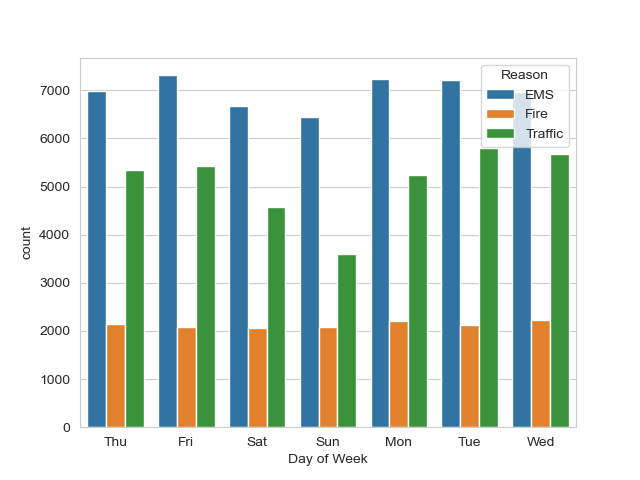
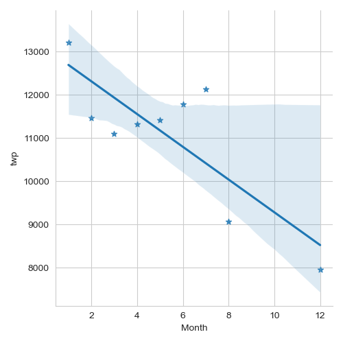
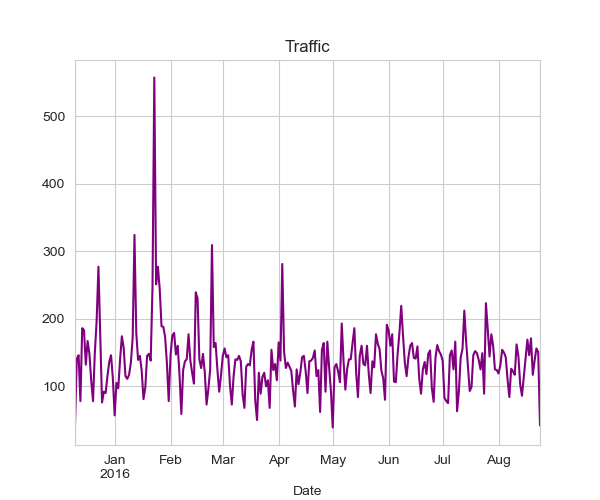
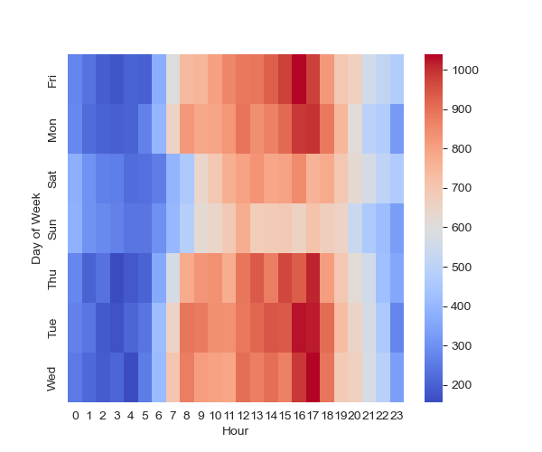

# 911 Calls Analysis

## 📌 Overview  
This project analyzes **911 emergency call data** to uncover patterns and trends in emergency incidents.  
The dataset contains detailed information on emergency calls including **location**, **time**, and **category** of the call.

---

## 🎯 Objectives  
- Explore the dataset and identify **patterns in emergency calls**.  
- Analyze trends across **time dimensions** (hour, day, month).  
- Compare call volumes by **emergency type** (EMS, Fire, Traffic).  
- Use **data visualization** to present findings in a clear and insightful way.

---

## 🛠 Tools & Technologies  
- **Python**  
- **Pandas & NumPy**  
- **Matplotlib & Seaborn**  
- **Jupyter Notebook**

---

## 📊 Key Insights  
- Seasonal and daily patterns in emergency calls.  
- Distribution of emergencies by category (Traffic, Fire, EMS).  
- Trends over time visualized with line plots and histograms.

---

## 📈 Visualizations  

### 1️⃣ 911 Calls by Day of Week and Reason  
Shows how call volume varies by day and type (Traffic, Fire, EMS).  

  

---

### 2️⃣ 911 Calls per Month  
Highlights monthly variations and seasonal patterns.  

  

---

### 3️⃣ Daily 911 Calls by Reason  
Displays daily call frequency across the dataset.  

  

---

### 4️⃣ Heatmap of 911 Calls by Hour and Day  
Visualizes when emergencies happen most often across hours and days.  

  

## ✅ Conclusion
📈 These insights highlight how data visualization can uncover trends in emergency response  
and help decision-makers improve resource allocation, response times, and public safety.
